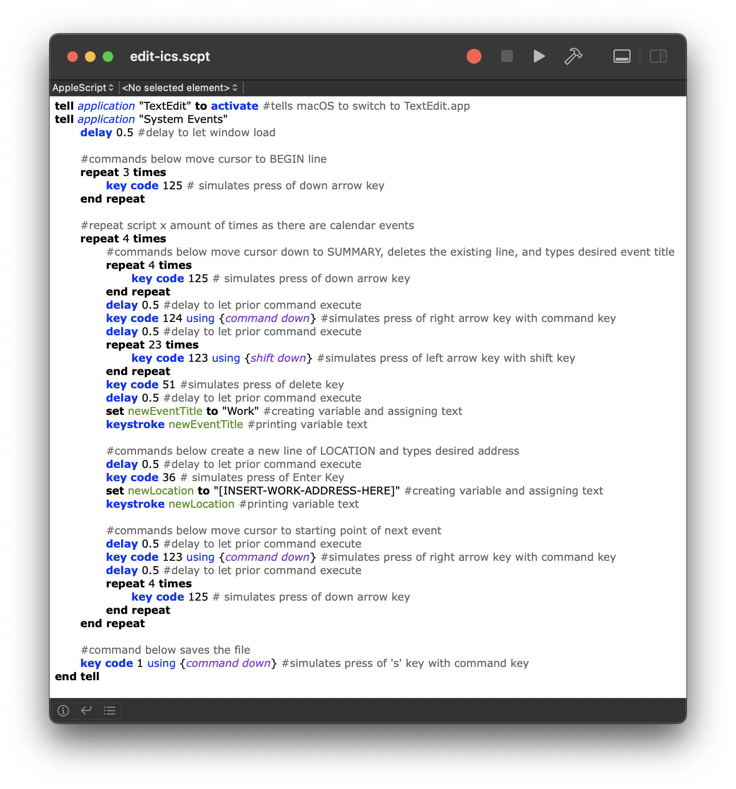
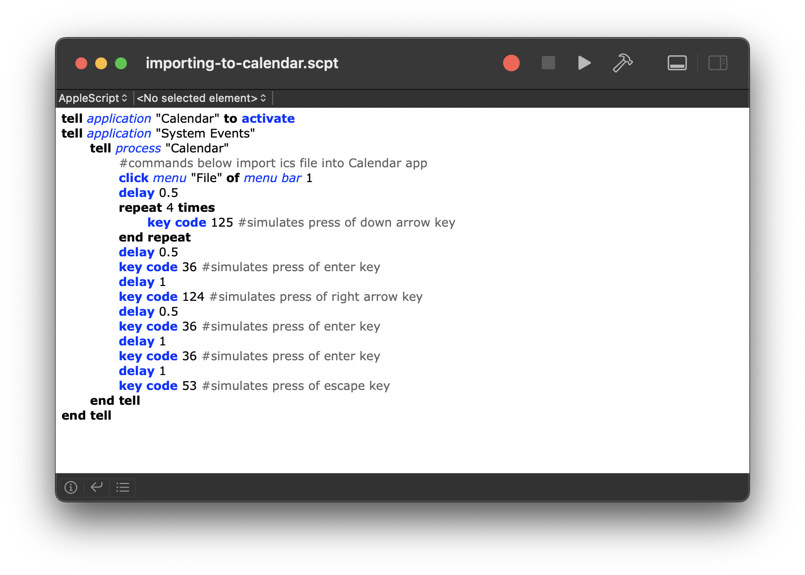
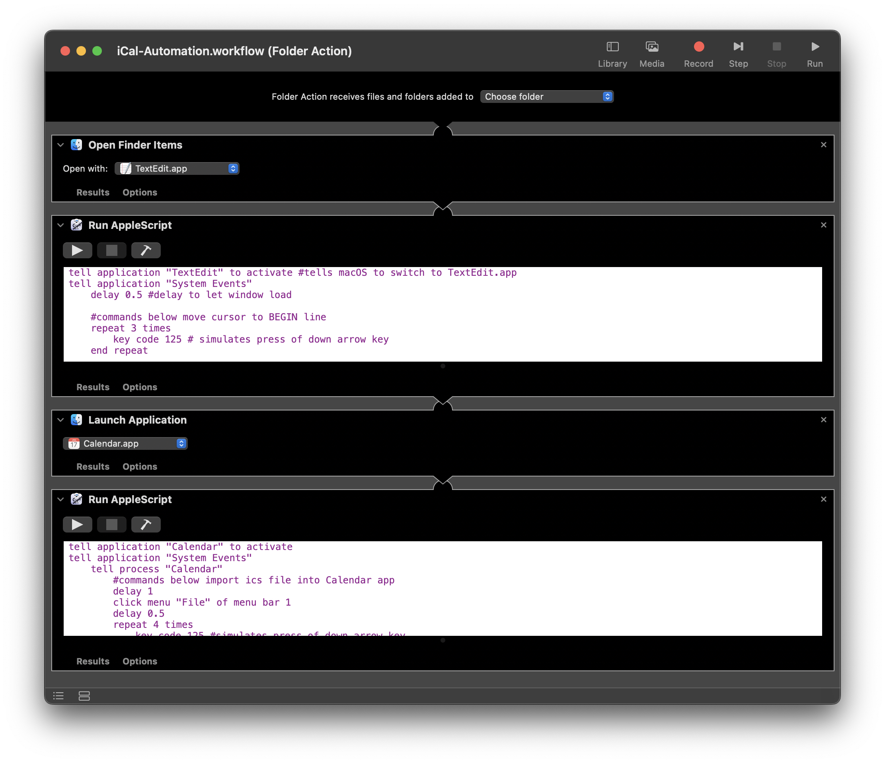

# The Calendar.app Workflow That Got Away
Before my workplace changed their scheduling software:
1. I used to have to download an .ics file of my work schedule
2. I would open the .ics file in a text editor and edit the title and location of each event.
3. I would import that into Calendar.app on macOS and change to my Work calendar
4. I would duplicate each event into a separate shared calendar and change the title so that it ended in '-Eric'

After doing this process every two weeks or so I thought that I could figure out a way to automate it by using AppleScript to do all the duplication and event editing for me. Since I was editing the plain text of the .ics file anyway, if I could find a way to parse through the file and change the necessary information, I could then take that and import that updated file.

*Using key codes in AppleScript to simulate key presses in order to edit the necessary lines of text*

 

*Using key codes in AppleScript to simulate key presses in order to complete the same actions as when using a mouse*

*Here's the partially completed Automation workflow that essentially ties both of the above .scpt files into a single action once the .ics file was moved to a particular directory*

Pretty soon after starting this project, my work decided to partner with a different scheduling company that offered calendar subscription URLs. This change essentially solved my initial problem of having to edit the title and address of each event separately but I still manually had to go in every couple of weeks and duplicate from the subscription to my own personal and shared calendars. 

Looking back at these files, I'm realizing that without better documentation it's pretty confusing to try and decipher what I was exactly doing back then. Albeit, I left comments of what each key code did but without the context of the .ics file itself, it's almost meaningless to me at this point.

I'm still going to include the .scpt files and the Automator workflow of this half-completed project for documentation of my learning and also a reminder to myself of how to improve in the future.

